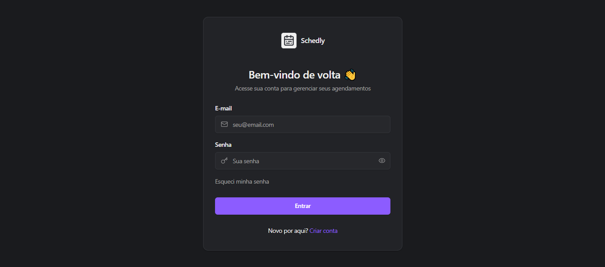
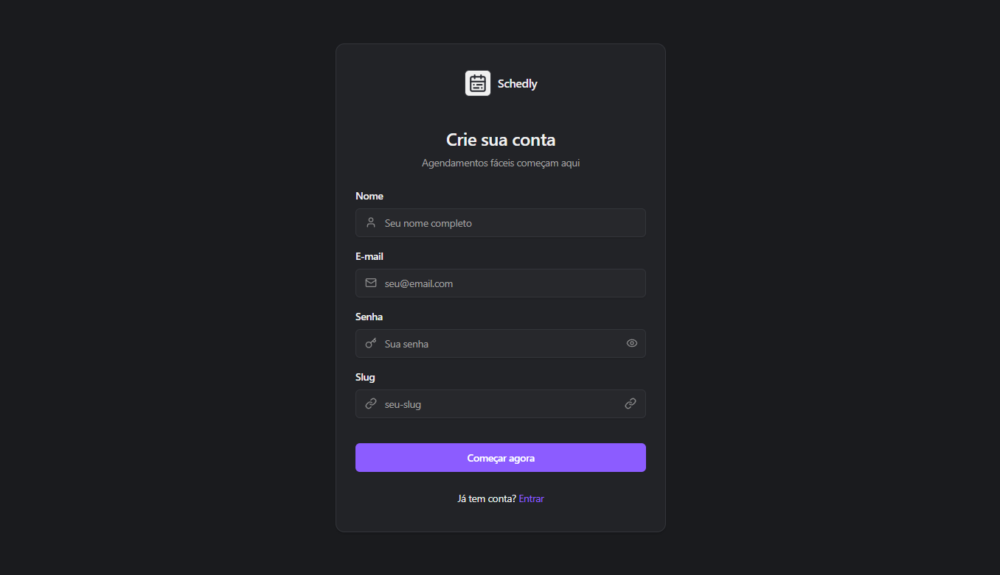

# Schedly

Schedly é um projeto que desenvolvi para o meu portfólio com o objetivo de mostrar na prática minhas habilidades como dev full stack.

A proposta é simples: criar uma aplicação moderna e funcional para agendamento de eventos e horários, com foco em experiência do usuário, arquitetura limpa, escalabilidade e boas práticas de engenharia de software. Tudo isso com uma interface bonita, responsiva e fácil de usar.

Abaixo você já pode ver algumas telas do Schedly:


## O que o Schedly faz

- 🗓️ Permite criar e gerenciar eventos e disponibilidades
- 👥 Oferece perfis de usuário personalizáveis
- 🌐 Interface moderna, fluida e responsiva
- 🔐 Autenticação segura com JWT
- 🎨 Tema claro/escuro
- 🌍 Lida com diferentes fusos horários
- 📱 Totalmente mobile-first
- 🚀 Estruturado para alta performance e escalabilidade

## Tecnologias

### Backend
- [FastAPI](https://fastapi.tiangolo.com/) - Framework web moderno e rápido
- [SQLModel](https://sqlmodel.tiangolo.com/) - ORM SQL para Python
- [PostgreSQL](https://www.postgresql.org/) - Banco de dados relacional
- [MinIO](https://min.io/) - Armazenamento de objetos
- [Alembic](https://alembic.sqlalchemy.org/) - Migrações de banco de dados
- [Poetry](https://python-poetry.org/) - Gerenciamento de dependências
- [JWT](https://jwt.io/) - Autenticação baseada em tokens
- [Pytest](https://docs.pytest.org/) - Framework de testes

### Frontend
- [React](https://react.dev/) - Biblioteca JavaScript para interfaces
- [TypeScript](https://www.typescriptlang.org/) - JavaScript tipado
- [Vite](https://vitejs.dev/) - Build tool moderna
- [TailwindCSS](https://tailwindcss.com/) - Framework CSS utilitário
- [Radix UI](https://www.radix-ui.com/) - Componentes acessíveis
- [React Query](https://tanstack.com/query/latest) - Gerenciamento de estado e cache
- [React Router](https://reactrouter.com/) - Roteamento
- [React Hook Form](https://react-hook-form.com/) - Gerenciamento de formulários
- [Zod](https://zod.dev/) - Validação de esquemas

## Como Rodar Localmente 🚀

Se você quiser testar a aplicação localmente, é super simples:

### Pré-requisitos

- [Docker](https://www.docker.com/)
- [Docker Compose](https://docs.docker.com/compose/)

### Como iniciar

1. Clone o repositório:
```
git clone https://github.com/joaopedrodevms/Schedly.git
cd Schedly
```

2. Suba os serviços com Docker Compose:
```
docker compose up -d
```

A aplicação estará disponível em:
- Frontend: http://localhost:5173
- Backend API: http://localhost:8000
- MinIO Console: http://localhost:9001
- PostgreSQL: localhost:5432

## Estrutura do Projeto

O projeto segue uma arquitetura limpa e modular:

### Backend
- \`/core\` - Regras de negócio e modelos
- \`/interface\` - APIs e rotas
- \`/infra\` - Implementações de infraestrutura
- \`/use_cases\` - Casos de uso da aplicação

### Frontend
- \`/components\` - Componentes reutilizáveis
- \`/pages\` - Páginas da aplicação
- \`/context\` - Contextos React
- \`/hooks\` - Hooks personalizados
- \`/service\` - Serviços e integrações


## Pré-visualização

Algumas telas da aplicação:

### Tela Inicial


### Eventos


### Configurações


### Autenticação



Tem mais imagens na pasta /screenshots, inclusive com variações de tema.

## Licença

Este projeto está sob a licença MIT. Veja o arquivo [LICENSE](LICENSE) para mais detalhes.